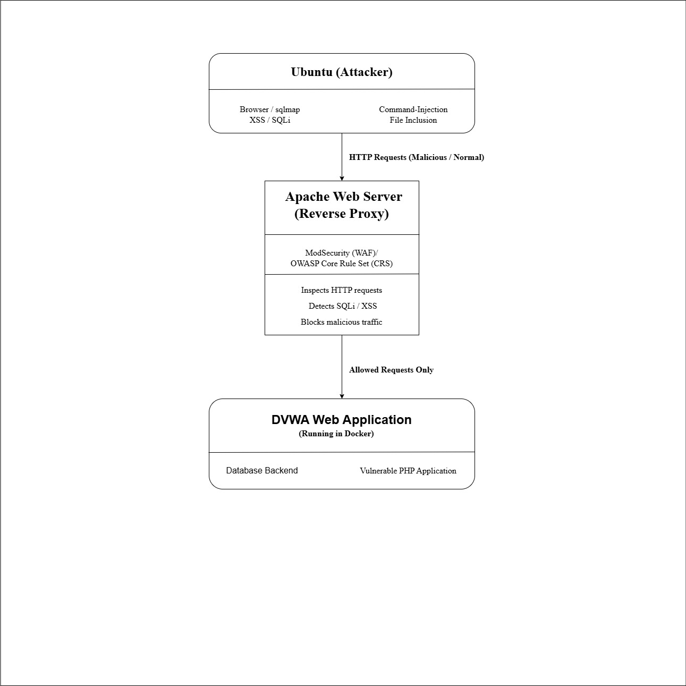
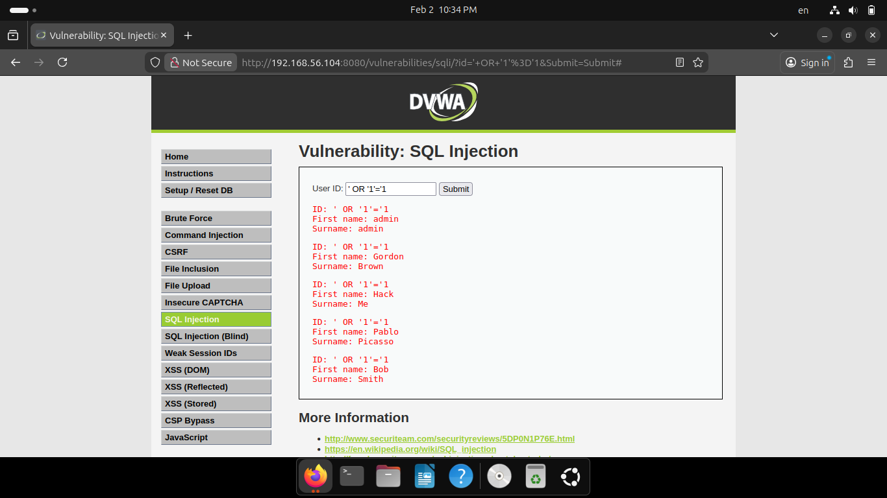
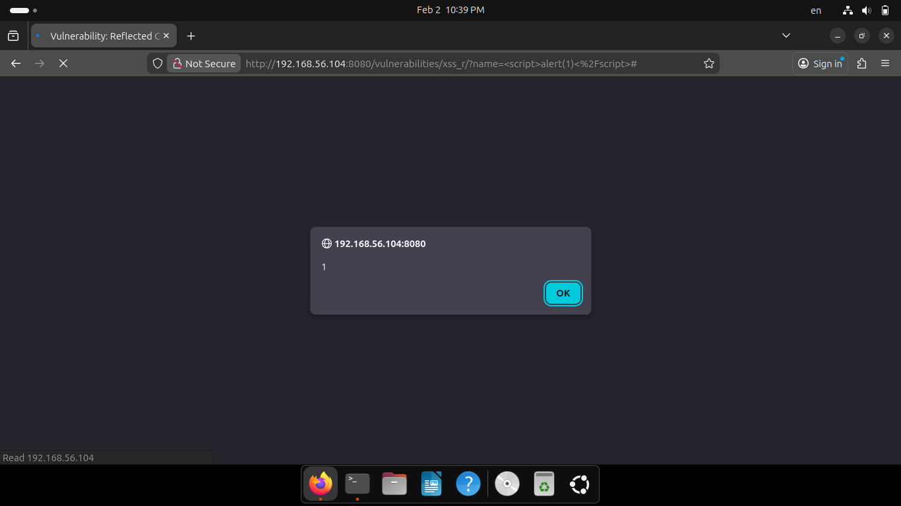
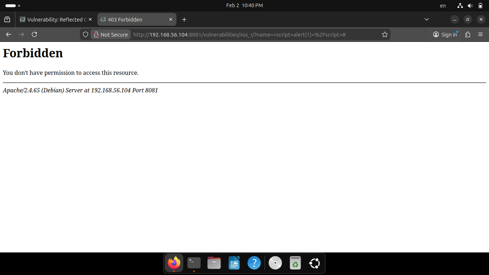

# 🛡️ Secure Web Application Deployment Using WAF  
> **Advanced Secure Software Design for Real-Time Web Attack Detection & Prevention**

<div align="center">


*A comprehensive Secure Software Design project demonstrating real-time web application attack detection and prevention using industry-standard Web Application Firewall architecture.*

</div>

---

## 🎯 Project Overview

This project demonstrates **Secure Software Design (SSD)** principles by protecting a vulnerable web application against **application-layer attacks** using a **Web Application Firewall (WAF)**.

Instead of modifying the application source code, a **secure deployment architecture** is designed using **Apache + ModSecurity + OWASP Core Rule Set (CRS)** to provide **defense-in-depth**, which is widely adopted in real-world enterprise systems.

---

## 🚀 Key Features

- 🔍 Real-time attack detection  
- 🚫 Automatic blocking of malicious requests  
- 🧱 Defense-in-depth secure architecture  
- 📜 Detailed audit logging  
- ⚙️ Anomaly-based detection (OWASP CRS)  
- 🐳 Containerized application deployment  
- 🔄 Reverse proxy security layer  
- 🔐 Secure deployment without code modification  

---

## 🏗️ Secure System Architecture




### Architecture Explanation

- All HTTP requests pass through the **Web Application Firewall**
- Malicious traffic is **blocked immediately**
- Only legitimate requests reach the application
- All detected attacks are logged for monitoring and auditing

---

## 💻 Technology Stack

| Component | Technology |
|----------|------------|
| Operating System | Kali Linux |
| Attacker Machine | Ubuntu Linux |
| Web Application | DVWA |
| Containerization | Docker |
| Web Server | Apache |
| Web Application Firewall | ModSecurity |
| Security Rules | OWASP Core Rule Set |
| Virtualization | VirtualBox |

---

## 🧪 Attacks Demonstrated

- 🔴 SQL Injection  
- 🔴 Cross-Site Scripting (XSS)  
- 🔴 Command Injection  
- 🔴 File Inclusion / Directory Traversal  

All attacks were performed in a **controlled laboratory environment**.

---

## 🔐 Secure Software Design Concepts Applied

- Secure Architecture Design  
- Defense in Depth  
- Threat Modeling  
- Secure Deployment  
- Attack Surface Reduction  
- Compensating Security Controls  
- Secure Configuration Management  
- Logging and Monitoring  

---

## ⚙️ How the System Works

1. Attacker sends an HTTP request  
2. Apache intercepts the request  
3. ModSecurity inspects the request payload  
4. OWASP CRS evaluates the anomaly score  
5. Malicious request is blocked (**403 Forbidden**)  
6. Attack details are logged  

---

## 📊 Logging & Monitoring

All detected attacks are logged in:
/var/log/apache2/modsec_audit.log

Log details include:
- Attacker IP address  
- Attack type  
- Triggered rule ID  
- Action taken (Blocked)  

---

## 🚀 How to Run the Project

1. Start Kali and Ubuntu virtual machines  
2. Enable **Host-Only** and **NAT** network adapters
3. Install Docker
    ```bash
     sudo apt update
     sudo apt install docker.io -y
    ``` 
4. Pull & Run DVWA in Docker on Kali
   ```bash
   sudo docker pull vulnerables/web-dvwa
   sudo docker run -d -p 8080:80 vulnerables/web-dvwa
   ```
   Check:
   ```bash
   sudo docker ps  
5. Install Apache + ModSecurity (KALI)
   ```bash
   sudo apt update 
   sudo apt install apache2 libapache2-mod-security2 git -y
   ```
   Enable modules:
   ```bash
   sudo a2enmod security2 
   sudo a2enmod proxy 
   sudo a2enmod proxy_http
   ```
6. Enable ModSecurity Blocking Mode
   ```bash
   sudo cp /etc/modsecurity/modsecurity.conf-recommended /etc/modsecurity/modsecurity.conf 
   sudo nano /etc/modsecurity/modsecurity.conf
   ```
   Change:
   ```bash
   SecRuleEngine DetectionOnly
   ``` 
   To:
   ```bash 
   SecRuleEngine On
   ``` 
   Save & exit.
7. Install OWASP CRS
   ```bash
   cd /etc/modsecurity 
   sudo git clone https://github.com/coreruleset/coreruleset.git 
   cd coreruleset 
   sudo cp crs-setup.conf.example crs-setup.conf
   ```
8. Link CRS with Apache (IMPORTANT)
    Edit: 
    ```bash
   sudo nano /etc/apache2/mods-enabled/security2.conf
    ``` 
   Use ONLY this content:
   ```bash
    <IfModule security2_module> 
      SecDataDir /var/cache/modsecurity 
      Include /etc/modsecurity/modsecurity.conf 
      Include /etc/modsecurity/coreruleset/crs-setup.conf 
      Include /etc/modsecurity/coreruleset/rules/*.conf 
    </IfModule>
   ```
9. Fix ModSecurity Logs (IMPORTANT)
      ```bash
      sudo touch /var/log/apache2/modsec_audit.log 
      sudo chown www-data:www-data /var/log/apache2/modsec_audit.log 
      sudo chmod 640 /var/log/apache2/modsec_audit.log
      ```
10. Set Apache Reverse Proxy (WAF)

    **Change Apache Port**

    ```apache
    sudo nano /etc/apache2/ports.conf
    ```

    Add:
    ```apache
    Listen 8081
    ```

    **Create WAF Site**

    ```bash
    sudo nano /etc/apache2/sites-available/dvwa-waf.conf
    ```

    ```apache
    <VirtualHost *:8081>
        ProxyPreserveHost On
        ProxyPass / http://127.0.0.1:8080/
        ProxyPassReverse / http://127.0.0.1:8080/
    </VirtualHost>
    ```

    **Enable the Site**

    ```bash
    sudo a2ensite dvwa-waf.conf
    sudo a2dissite 000-default.conf
    ```

11. Increase Blocking Sensitivity (VERY IMPORTANT)
    ```bash
    sudo nano /etc/modsecurity/coreruleset/crs-setup.conf
    ```
    Uncomment & set:
    ```bash
    SecAction \ 
     "id:900110,phase:1,nolog,pass,t:none,\ 
      setvar:tx.inbound_anomaly_score_threshold=1"
    ```
12. Start Everything
    ```bash
    sudo apachectl configtest 
    sudo systemctl restart apache2 
    sudo systemctl status apache2 
    ```
13. Correct URLs (REMEMBER)
    |Purpose|URL|
    |--------------|-------| 
    |DVWA without WAF|http://KALI-IP:8080| 
    |DVWA protected|http://KALI-IP:8081|
14. Log Monitoring
    ```bash
    sudo tail -f /var/log/apache2/modsec_audit.log
    ```


## 🔄 Project Reactivation (After Shutdown)

```bash
sudo systemctl start docker apache2
docker start $(docker ps -aq)
```
---
## Attack Testing & WAF Evaluation

This section evaluates the effectiveness of the Web Application Firewall (WAF) by performing real-world web attacks on DVWA.

## 1. SQL Injection (SQLi) Attack

SQL Injection is a critical web vulnerability where an attacker manipulates SQL queries to gain unauthorized access to the database.

### 1.1 SQL Injection Without WAF (Insecure DVWA)


### 1.2 SQL Injection With WAF Enabled (Secure DVWA)


## 2. Cross-Site Scripting (XSS) Attack

Cross-Site Scripting (XSS) is a client-side web vulnerability that allows attackers to inject malicious JavaScript code into web pages viewed by other users.

### 2.1 XSS Without WAF (Insecure DVWA)


### 2.2 XSS With WAF Enabled (Secure DVWA)


---
## 🎓 Educational Value & Learning Outcomes

- Practical understanding of web application vulnerabilities  
- Hands-on experience with Web Application Firewall (WAF) deployment  
- Application of Secure Software Design (SSD) principles  
- Real-world attack simulation and mitigation  
- Secure deployment without modifying application source code  

---

## ⚠️ Ethical Disclaimer

This project is intended **strictly for educational and academic purposes**.  
All attacks were performed in an **isolated laboratory environment** on intentionally vulnerable software.

Unauthorized testing on real systems is **illegal and unethical**.

---

## 📚 References

- OWASP Top 10 Web Application Security Risks  
- OWASP ModSecurity Core Rule Set  
- Apache HTTP Server Documentation  
- Docker Documentation  
- NIST Secure Software Development Framework (SSDF)  

---
## 👻 Development Team 

### Contributors:
- **[@Q3hr](https://github.com/Q3hr)** 
- **[@PSYCHrt](https://github.com/PSYCHrt)** 
---
<div align="center">

**🎓 Developed for Secure Software Design (SSD)**

*Applying secure software principles through hands-on cybersecurity research*

[](#)
[](#)
[](#)
[](#)
[](#)

---

**"Secure by design, resilient by practice."**

**⭐ Star this repository if it supported your Secure Software Design learning journey!**

</div>


